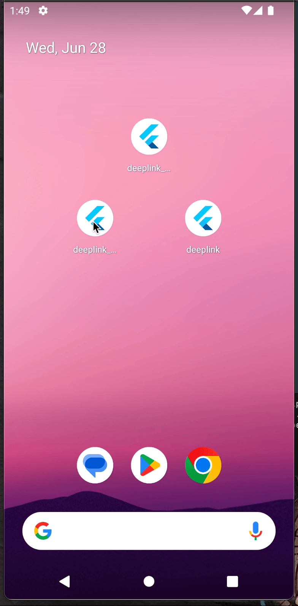
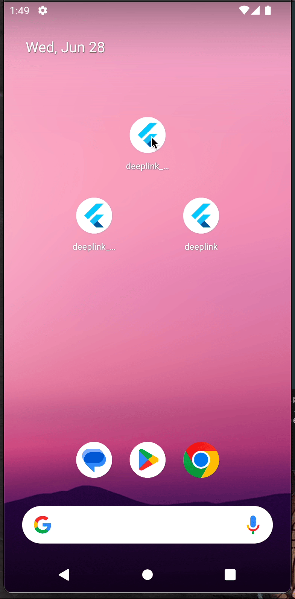
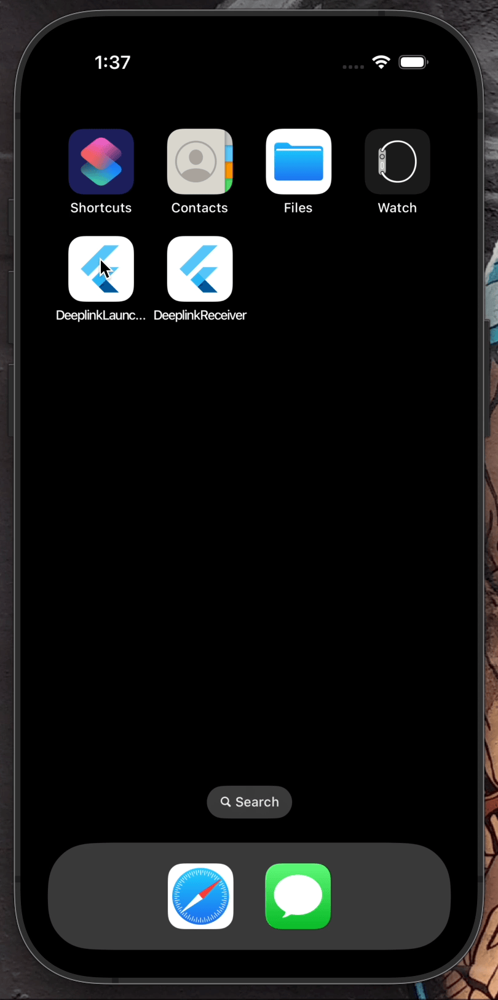
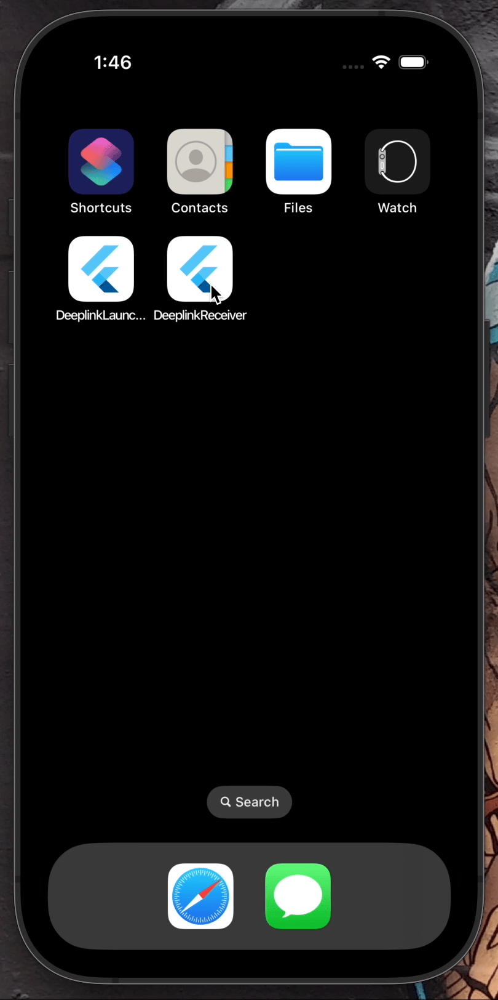

# Deep Link Handler

[](LICENSE)
[](https://flutter.dev)
[](https://github.com/askpradana/flutter-deeplink/stargazers)


This project features two Flutter apps that handle and launch a custom deep link. These programs, created with the [uni_links](https://pub.dev/packages/uni_links) and [url_launcher](https://pub.dev/packages/url_launcher) packages, efficiently handle deep links and launch them within their own apps.

This project also acts as a pleasant addition to my portfolio, displaying my abilities in deep link implementation using Flutter. It aims to be a useful resource for other students interested in understanding and implementing deep linkages in Flutter apps. Learners can acquire insights into efficiently integrating deep linking capabilities into their own applications and enhance their expertise in this area by investigating the code and functions.

## Table of Contents
- [Deep Link Handler](#deep-link-handler)
  - [Table of Contents](#table-of-contents)
  - [Features](#features)
  - [Example](#example)
  - [Getting Started](#getting-started)
  - [Contributing](#contributing)
  - [License](#license)
  - [Contact Information](#contact-information)

## Features

- Handle custom deep links in Flutter.
- Launch deep links using the [url_launcher](https://pub.dev/packages/url_launcher) package.
- Example applications demonstrating deep link handling and launching.

## Example

| Android with deeplink | Android without deeplink | iOS with deeplink | iOS without deeplink |
|-------|-------|-------|-------|
|  |  |  |  |


## Getting Started

To get started with this project, follow these steps:

1. Clone the repository:

``` git clone https://github.com/askpradana/flutter-deeplink```

2. Install Flutter (if not already installed). For installation instructions, refer to the official Flutter documentation: [Flutter Installation Guide](https://flutter.dev/docs/get-started/install)

3. Open the two Flutter applications in separate instances of your preferred IDE or code editor.

4. Run `flutter pub get` to fetch the required dependencies for each application.

5. Launch **BOTH** applications on your desired devices or emulators using `flutter run`.

6. Test the deep link handling and launching functionality by triggering custom deep links.

## Contributing

Contributions are welcome! If you encounter any issues or have suggestions for improvements, please open an issue or submit a pull request. Your contributions will be greatly appreciated.

## License

This project is licensed under the GNU Affero General Public License. See the [LICENSE](LICENSE.txt) file for more details.

## Contact Information
Feel free to ask or connect
- [LinkedIn](https://www.linkedin.com/in/nfldyprdn/)
